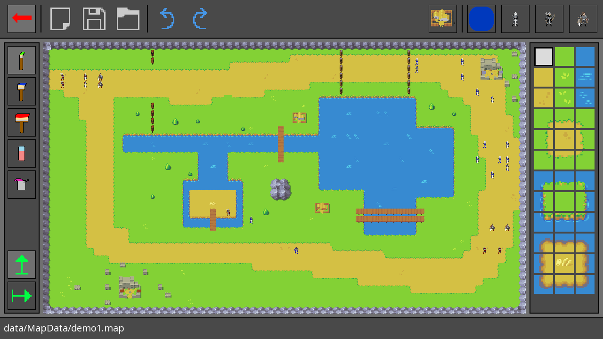
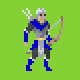

# LifProjet

## Auteurs

Projet réalisé par Marc BRUSTOLIN, Thibaut PEYRIC, Raphaël RICHARD, dans le cadre de
l'UE LifProjet, sous la tutelle de Samir AKNINE. 

## Objectifs 

L’objectif de ce projet est de proposer une modélisation distribuée
d’un jeu stratégique. Nous prendrons comme exemple le tactical RPG.

Nous considérerons des personnages qui évoluent sur un environnement 
dynamique. Les personnages appartiennent à plusieurs groupes. Les 
personnages peuvent se déplacer en même temps selon des règles préétablies. 

Nous implémenterons une méthode de résolution distribuée avec des entités 
autonomes dotée de comportements intelligents. Nous commencerons par définir
des stratégies de résolution simples dans lesquelles les personnages 
effectuent des déplacements uniquement sur la base de leur perception.
Dans une deuxième étape, nous définirons des stratégies de résolution 
plus fines permettant aux personnages de construire des stratégies de 
jeu collectives en interagissant avec leur voisinage.

 

## Implémentation 

L'implémentation proposée de ce projet s'articule autours de plusieurs axes :
- Deux équipe se battent sur un terrain : l'équipe rouge attaque et pour gagner, 
  doit détruire le chateau de l'équipe bleue qui elle, doit vaincre tous les assaillants.
  

  

- Un éditeur de niveau est fourni avec 3 emplacements de sauvegarde, permettant de 
  placer des soldats, des bâtiments, ainsi que modeler le terrain pour mieux mettre en
  lumière les interactions entre tous les éléments.
  

- Lors du lancement de la simulation, un choix entre les différents scénarios (de base et 
  emplacements de sauvegarde) est demandé. Après selection, la simulation est lancée. 
  Il est possible d'accélerer, ralentir et stopper le temps.
  

- Les bâtiments ont une influence sur les stats des entités de la même équipe, les villages 
  boostent la vitesse tandis que le chateau augmente les dégâts.
  

- Trois types d'unités différentes sont implémentées : le chevalier (vite et dégâts standards), l'archer (moins de vie mais
  attaque à distance) et le paladin (plus de vie et moins d'attaque). Ces unités ont aussi des cible de prédilection : les archers
  visent en priorité les paladins et ceux-ci les bâtiments).
  
     

- Les entités possèdent des comportement particuliers comme la mise en groupe lorsqu'un trop grand nombre d'ennemis sont présent 
  (comme sur l'image suivante). Les défenseurs ont aussi la faculté de défendre un village et, losque trop de défenseurs ont été 
  vaincus, de battre en retraite jusqu'au chateau. Par ailleurs, lorsque celui-ci est attaqué, les défenseurs restants sur la 
  carte sont appellés pour le défendre.

## Dépendances 

Le projet est construit avec la librairie SFML 2.5.1. Il est nécessaire de l'installer afin de lancer l'application :
https://www.sfml-dev.org/download/sfml/2.5.1/index-fr.php

## Compilation

La compilation requiert un compilateur C++ supportant le standard C++17. Elle s'effectue selon la plateforme :

- Windows : Télécharger la version de SFML correspondant à votre compilateur (MinGW ou MSVC) puis la déposer dans le dossier `lib`
 à la racine du projet. Le fichier CMakeList.txt reconnaîtra le chemin et fera le lien (statique) avec la lib.
  

- Linux et MacOS : Installer CMake si ce n'est pas déja fait ainsi que SFML 2.5.1 (via `brew` ou `apt`), s'assurer que le chemin se trouve
dans le `$PATH`. Saisir la commande `cmake -DCMAKE_BUILD_TYPE=Release CMakeLists.txt ` puis `make` et `./LifProjet`.
  

## Documentation 

Avec Doxygen installé, saisir la commande `doxygen Doxyfile` à la racine du projet. La documentation est générale dans le dossier `doc`

## Sources 

- Architecture et classes de base :
SFML Game Development - Artur Moreira, Henrik Vogelius Hansson, Jan Haller - 2013 (les classes reprises sont marquées
  comme telles via le tag @author dans les headers).

- Sprites :
Loreon Kingdom Characters by sanctumpixel on itch.io (achetées).

- Tileset :
https://lpc.opengameart.org/content/overworld-tiles-0 by Buck and Jeffrey Kern as the committer and creative consultant.
  

- Titre du menu principal et fonds : 
    * WesterosCraft (https://westeroscraft.com/)
    * Tephra Castle by NoxusBolgar (https://www.gamesradar.com/50-stunning-minecraft-screenshots/5/)
    * Castle build by TomatoN (https://www.youtube.com/watch?v=JzufxFWleDQ)
    * Medieval Castle! (https://www.planetminecraft.com/project/medieval-castle-1377344/)

- Musiques :
    * Age of Empire 2 Main Menu Music : https://www.youtube.com/watch?v=RRtlWfi6jiM
    * Age of Empire 3 Battle Track : https://www.youtube.com/watch?v=RRtlWfi6jiM
  

Tous les contenus précédents appartiennent à leurs auteurs respectifs.
